Exploratory Data Analysis in the Tidyverse
================
Michael Levy <michael.levy@healthcatalyst.com>
2018-04-05

# What is the Tidyverse?


> The tidyverse is an opinionated collection of R packages designed for
> data science. All packages share an underlying design philosophy,
> grammar, and data structures.

  - Associated with Hadley Wickham & Backed by RStudio
  - Data frames are the cornerstone
  - Use [tidy
    data](https://cran.r-project.org/web/packages/tidyr/vignettes/tidy-data.html)
      - Each observation gets a row
      - Each variable gets a column
      - Each type of observation gets a table
  - Consistent nonstandard evaluation (NSE)
  - Standard API: Data frame (or vector) is first argument
      - Enables piping

## Packages

Core – attached on `library(tidyverse)`:

  - `readr`: Data import
  - `tibble`: Better data frames
  - `tidyr`: Data reshaping
  - `dplyr`: Data manipulation
  - `stringr`: String manipulation
  - `forcats`: Factor manipulation
  - `ggplot2`: Data visualization
  - `purrr`: Functional programming

Non-core – installed on `install.packages("tidyverse")`: `lubridate`,
`recipes`, `readxl`, `rlang`, and
    more…

``` r
library(tidyverse)
```

    ## ── Attaching packages ────────────────────────────────────── tidyverse 1.2.1 ──

    ## ✔ ggplot2 2.2.1     ✔ purrr   0.2.4
    ## ✔ tibble  1.4.2     ✔ dplyr   0.7.4
    ## ✔ tidyr   0.8.0     ✔ stringr 1.3.0
    ## ✔ readr   1.1.1     ✔ forcats 0.2.0

    ## ── Conflicts ───────────────────────────────────────── tidyverse_conflicts() ──
    ## ✖ dplyr::filter() masks stats::filter()
    ## ✖ dplyr::lag()    masks stats::lag()

# `readxl`

We’ll start with one of the non-core packages, `readxl` to load our
data.

The data we’ll be exploring comes from the 2018 [World Happiness
Report](http://worldhappiness.report/ed/2018/) which uses the Gallup
World Poll as its source. The data are available
[here](https://s3.amazonaws.com/happiness-report/2018/WHR2018Chapter2OnlineData.xls)
as a `.xls` file. There is more information on the questions contained
in this report in the [data appendix](#app). The `tidyverse` package
`readxl` will allow us to import it directly into R.

``` r
d <- readxl::read_excel("WHR2018Chapter2OnlineData.xls")
```

# `tibble`

What did we get? A “tibble” (`tbl_df`) with child-class `data.frame`.

``` r
class(d)
```

    ## [1] "tbl_df"     "tbl"        "data.frame"

Tibbles are opinionated in their printing, among other things. Some of
the print options are a little intrusive for me, so I [customize
them](https://www.tidyverse.org/articles/2018/01/tibble-1-4-2/) in my
`.Rprofile` file, e.g. `pillar.subtle = FALSE` to avoid graying-out
insignificant digits.

``` r
d
```

    ## # A tibble: 1,562 x 19
    ##    country      year `Life Ladder` `Log GDP per capita` `Social support`
    ##    <chr>       <dbl>         <dbl>                <dbl>            <dbl>
    ##  1 Afghanistan 2008.          3.72                 7.17            0.451
    ##  2 Afghanistan 2009.          4.40                 7.33            0.552
    ##  3 Afghanistan 2010.          4.76                 7.39            0.539
    ##  4 Afghanistan 2011.          3.83                 7.42            0.521
    ##  5 Afghanistan 2012.          3.78                 7.52            0.521
    ##  6 Afghanistan 2013.          3.57                 7.50            0.484
    ##  7 Afghanistan 2014.          3.13                 7.48            0.526
    ##  8 Afghanistan 2015.          3.98                 7.47            0.529
    ##  9 Afghanistan 2016.          4.22                 7.46            0.559
    ## 10 Afghanistan 2017.          2.66                 7.46            0.491
    ## # ... with 1,552 more rows, and 14 more variables: `Healthy life
    ## #   expectancy at birth` <dbl>, `Freedom to make life choices` <dbl>,
    ## #   Generosity <dbl>, `Perceptions of corruption` <dbl>, `Positive
    ## #   affect` <dbl>, `Negative affect` <dbl>, `Confidence in national
    ## #   government` <dbl>, `Democratic Quality` <dbl>, `Delivery
    ## #   Quality` <dbl>, `Standard deviation of ladder by country-year` <dbl>,
    ## #   `Standard deviation/Mean of ladder by country-year` <dbl>, `GINI index
    ## #   (World Bank estimate)` <dbl>, `GINI index (World Bank estimate),
    ## #   average 2000-15` <dbl>, `gini of household income reported in Gallup,
    ## #   by wp5-year` <dbl>

### No partial name matching

``` r
d$count
```

    ## Warning: Unknown or uninitialised column: 'count'.

    ## NULL

### Tibbles stay tibbles

Following is equivalent to `data.frame[, "country", drop = FALSE]`,
where without specifying `drop` we would “drop” a dimension and
(surprise\!) get a vector back.

``` r
d[, "country"]
```

    ## # A tibble: 1,562 x 1
    ##    country    
    ##    <chr>      
    ##  1 Afghanistan
    ##  2 Afghanistan
    ##  3 Afghanistan
    ##  4 Afghanistan
    ##  5 Afghanistan
    ##  6 Afghanistan
    ##  7 Afghanistan
    ##  8 Afghanistan
    ##  9 Afghanistan
    ## 10 Afghanistan
    ## # ... with 1,552 more rows

### Strings not automatically factors

``` r
animals <- tibble(name = c("Fido", "Socks", "Ralph"),
                  species = factor(c("dog", "cat", "dog")))
animals
```

    ## # A tibble: 3 x 2
    ##   name  species
    ##   <chr> <fct>  
    ## 1 Fido  dog    
    ## 2 Socks cat    
    ## 3 Ralph dog

### `tribble` to create by row instead of by column:

``` r
tribble(
  ~name,  ~age,  ~state,
  "Jill", 24,    "CA",
  "Joe",  65,    "AK",
  "Sam",  14,    "CO"
)
```

    ## # A tibble: 3 x 3
    ##   name    age state
    ##   <chr> <dbl> <chr>
    ## 1 Jill    24. CA   
    ## 2 Joe     65. AK   
    ## 3 Sam     14. CO

### Clean column names

`tibble` supports non-syntactic names, and tidyverse import functions
don’t generally sanitize names. But, protecting them with backticks is
annoying, so let’s clean them up. `tibble::set_tidy_names` also makes
sure there are no duplicated names, as can happen on a join and bite
hard.

``` r
d <- set_tidy_names(d, syntactic = TRUE)
```

    ## New names:
    ## Life Ladder -> Life.Ladder
    ## Log GDP per capita -> Log.GDP.per.capita
    ## Social support -> Social.support
    ## Healthy life expectancy at birth -> Healthy.life.expectancy.at.birth
    ## Freedom to make life choices -> Freedom.to.make.life.choices
    ## Perceptions of corruption -> Perceptions.of.corruption
    ## Positive affect -> Positive.affect
    ## Negative affect -> Negative.affect
    ## Confidence in national government -> Confidence.in.national.government
    ## Democratic Quality -> Democratic.Quality
    ## Delivery Quality -> Delivery.Quality
    ## Standard deviation of ladder by country-year -> Standard.deviation.of.ladder.by.country.year
    ## Standard deviation/Mean of ladder by country-year -> Standard.deviation.Mean.of.ladder.by.country.year
    ## GINI index (World Bank estimate) -> GINI.index..World.Bank.estimate.
    ## GINI index (World Bank estimate), average 2000-15 -> GINI.index..World.Bank.estimate...average.2000.15
    ## gini of household income reported in Gallup, by wp5-year -> gini.of.household.income.reported.in.Gallup..by.wp5.year

# `stringr`

I dislike using “.” to separate words, and I really dislike the “..”
that’s left where there was " (“, so let’s replace any number of dots
with one underscore. Enter `stringr` for string manipulation.

``` r
str_replace_all(names(d), "\\.+", "_")
```

    ##  [1] "country"                                                
    ##  [2] "year"                                                   
    ##  [3] "Life_Ladder"                                            
    ##  [4] "Log_GDP_per_capita"                                     
    ##  [5] "Social_support"                                         
    ##  [6] "Healthy_life_expectancy_at_birth"                       
    ##  [7] "Freedom_to_make_life_choices"                           
    ##  [8] "Generosity"                                             
    ##  [9] "Perceptions_of_corruption"                              
    ## [10] "Positive_affect"                                        
    ## [11] "Negative_affect"                                        
    ## [12] "Confidence_in_national_government"                      
    ## [13] "Democratic_Quality"                                     
    ## [14] "Delivery_Quality"                                       
    ## [15] "Standard_deviation_of_ladder_by_country_year"           
    ## [16] "Standard_deviation_Mean_of_ladder_by_country_year"      
    ## [17] "GINI_index_World_Bank_estimate_"                        
    ## [18] "GINI_index_World_Bank_estimate_average_2000_15"         
    ## [19] "gini_of_household_income_reported_in_Gallup_by_wp5_year"

Things I like about `stringr`:

  - String always comes first, then the pattern
  - Consistent, descriptive names (`regexpr`, `gregexpr`, `regexec`… 😡)
  - `fixed` function for no regex: `str_split("3.2.0", fixed("."))`
    yields 3, 2, 0

# `magrittr`

`magrittr` gives us a pipe operator, `%>%`, which sends the output of
the function on its LHS to the input of the function on its RHS.

It allows us to avoid having to choose between nesting functions, in
which case arguments get far away from their functions, or repeated
reassignment, which either clutters the workspace or can make it hard to
recover from mistakes.

I didn’t actually change the names of the data frame above. In addition
to replacing dots with underscores, I want to make everything lowercase.
I’ll do both in one assignment and no nesting with the pipe.

``` r
names(d) <- 
  names(d) %>%
  str_replace_all("\\.+", "_") %>%
  tolower()
```

# `ggplot2`

> If visualization isn’t part of your exploratory process, you’re doing
> it wrong.

``` r
d %>%
  ggplot(aes(x = year, y = healthy_life_expectancy_at_birth, group = country)) +
  geom_line(alpha = .5) + 
  scale_x_continuous(breaks = seq(2004, 2016, 2))
```

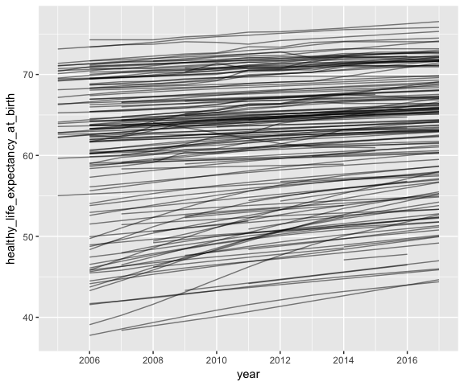<!-- -->

How about we look at all of the variables’ trends over time?

``` r
d %>%
  gather(key = question, value = value, -country, -year) %>%
  mutate(question = fct_inorder(question)) %>%
  ggplot(aes(x = year, y = value, group = country)) + 
  geom_line(alpha = .25) + 
  facet_wrap(~ question, scales = "free_y", ncol = 3) + 
  scale_x_continuous(breaks = seq(2004, 2016, 2))
```

    ## Warning: Removed 10 rows containing missing values (geom_path).

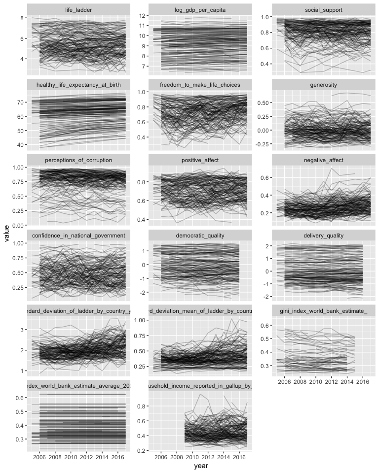<!-- -->

# `tidyr`

`tidyr` supersedes `reshape` and `reshape2` and does less. It mainly has
two functions, `gather` and `spread`, which are similar to the older
`melt` and `dcast` functions.

Our data is already tidy: each row is an observation (country-year) and
each variable is a column.

This is a trick to get the plot I want – let’s imagine that each
question asked is a variable, making the unit of observation a
country-year-question. Then we’d need one more variable: The answer to
the question, which I’m calling “value”.

``` r
d %>%
  gather(key = question, value = value, -country, -year) 
```

    ## # A tibble: 26,554 x 4
    ##    country      year question    value
    ##    <chr>       <dbl> <chr>       <dbl>
    ##  1 Afghanistan 2008. life_ladder  3.72
    ##  2 Afghanistan 2009. life_ladder  4.40
    ##  3 Afghanistan 2010. life_ladder  4.76
    ##  4 Afghanistan 2011. life_ladder  3.83
    ##  5 Afghanistan 2012. life_ladder  3.78
    ##  6 Afghanistan 2013. life_ladder  3.57
    ##  7 Afghanistan 2014. life_ladder  3.13
    ##  8 Afghanistan 2015. life_ladder  3.98
    ##  9 Afghanistan 2016. life_ladder  4.22
    ## 10 Afghanistan 2017. life_ladder  2.66
    ## # ... with 26,544 more rows

# `forcats`

Factors can be pain; `forcats` eases that pain.

`fct_inorder` reorders the level of a factor in the order they appear in
a data frame.

``` r
d %>%
  gather(key = question, value = value, -country, -year) %>%
  pull(question) %>%
  fct_inorder() %>%
  levels()
```

    ##  [1] "life_ladder"                                            
    ##  [2] "log_gdp_per_capita"                                     
    ##  [3] "social_support"                                         
    ##  [4] "healthy_life_expectancy_at_birth"                       
    ##  [5] "freedom_to_make_life_choices"                           
    ##  [6] "generosity"                                             
    ##  [7] "perceptions_of_corruption"                              
    ##  [8] "positive_affect"                                        
    ##  [9] "negative_affect"                                        
    ## [10] "confidence_in_national_government"                      
    ## [11] "democratic_quality"                                     
    ## [12] "delivery_quality"                                       
    ## [13] "standard_deviation_of_ladder_by_country_year"           
    ## [14] "standard_deviation_mean_of_ladder_by_country_year"      
    ## [15] "gini_index_world_bank_estimate_"                        
    ## [16] "gini_index_world_bank_estimate_average_2000_15"         
    ## [17] "gini_of_household_income_reported_in_gallup_by_wp5_year"

# `dplyr`

``` r
d %>%
  gather(key = question, value = value, -country, -year) %>%
  mutate(question = fct_inorder(question))
```

    ## # A tibble: 26,554 x 4
    ##    country      year question    value
    ##    <chr>       <dbl> <fct>       <dbl>
    ##  1 Afghanistan 2008. life_ladder  3.72
    ##  2 Afghanistan 2009. life_ladder  4.40
    ##  3 Afghanistan 2010. life_ladder  4.76
    ##  4 Afghanistan 2011. life_ladder  3.83
    ##  5 Afghanistan 2012. life_ladder  3.78
    ##  6 Afghanistan 2013. life_ladder  3.57
    ##  7 Afghanistan 2014. life_ladder  3.13
    ##  8 Afghanistan 2015. life_ladder  3.98
    ##  9 Afghanistan 2016. life_ladder  4.22
    ## 10 Afghanistan 2017. life_ladder  2.66
    ## # ... with 26,544 more rows

`group_by` provides a much friendlier version of `aggregate` or `tapply`
and maintains the data frame centric paradigm.

``` r
d %>%
  group_by(country) %>%
  summarize(mean_gdp = mean(log_gdp_per_capita),
            sd_gdp = sd(log_gdp_per_capita),
            rsd_gdp = sd_gdp / mean_gdp) %>%
  arrange(desc(rsd_gdp))
```

    ## # A tibble: 164 x 4
    ##    country      mean_gdp sd_gdp rsd_gdp
    ##    <chr>           <dbl>  <dbl>   <dbl>
    ##  1 China            9.25  0.281  0.0303
    ##  2 Laos             8.30  0.244  0.0294
    ##  3 Uzbekistan       8.46  0.209  0.0247
    ##  4 India            8.46  0.205  0.0243
    ##  5 Mozambique       6.85  0.158  0.0231
    ##  6 Bangladesh       7.88  0.176  0.0223
    ##  7 Sierra Leone     7.18  0.155  0.0215
    ##  8 Zimbabwe         7.42  0.160  0.0215
    ##  9 Rwanda           7.28  0.156  0.0214
    ## 10 Cambodia         7.93  0.169  0.0213
    ## # ... with 154 more rows

Let’s shift back to `ggplot` to take a visual look at the same
phenomenon.

I want to plot the distribution of GDP by country and have that look
sensible across 164 countries, and I only want to include countries for
which we have more than two observations of GDP. And just for fun, we’ll
color each country by its “affect score” the mean difference between its
positive and negative affect over the years.

To filter to countries where we have more than two recorded GDPs, we
take advantage of a neat self-join trick. Normally `group_by` is
followed by `summarize`, which aggregates across rows; but, `group_by`
%\>% `mutate` calculates group-level statistics and appends them to
every row. Here, this allows us to filter countries based on how many
recorded GDPs they have and calculate a mean affect score for each
country, all without leaving our original data frame.

``` r
d %>%
  group_by(country) %>%
  mutate(gdp_country_obs = n_distinct(log_gdp_per_capita, na.rm = TRUE),
         affect_score = mean(positive_affect - negative_affect, na.rm = TRUE)) %>%
  filter(gdp_country_obs > 2) %>%
  select(-gdp_country_obs) %>%
  ggplot(aes(x = fct_reorder(country, log_gdp_per_capita, quantile, .75, na.rm = TRUE), 
             y = log_gdp_per_capita,
             color = affect_score)) + 
  geom_boxplot(outlier.size = .5) + 
  coord_flip() +
  xlab(NULL) + 
  scale_y_continuous(labels = function(x) paste0("$", round(exp(x), 0))) + 
  viridis::scale_color_viridis() +
  theme(axis.text.y = element_text(size = 6))
```

    ## Warning: Removed 15 rows containing non-finite values (stat_boxplot).

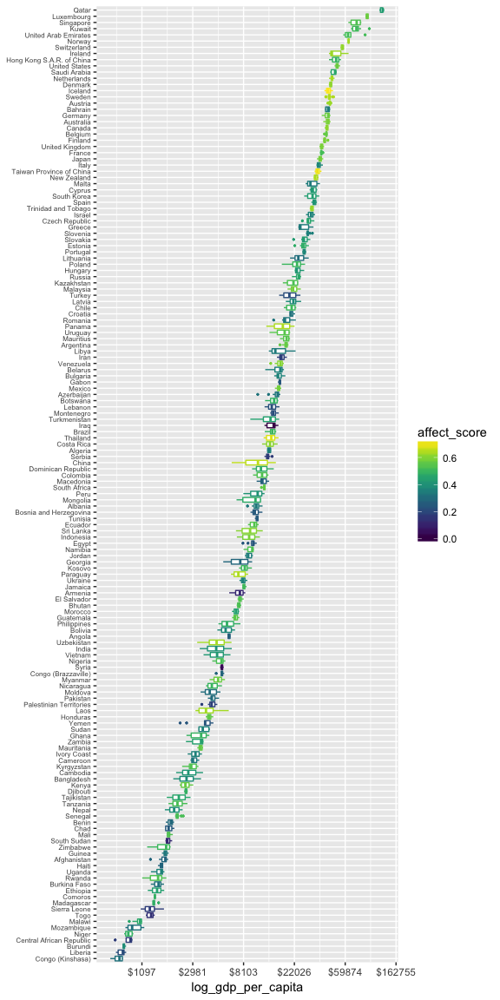<!-- -->

Hmm, it looks like all mean affect scores are positive. I wonder what
the relationship between positive and negative affect is. Let’s take a
look\!

``` r
affect_plot <- 
  d %>%
  ggplot(aes(x = negative_affect, y = positive_affect)) +
  geom_abline(slope = -1, intercept = 1, color = "dodgerblue", linetype = "dashed") +
  geom_point(size = .5, alpha = .5) +
  coord_fixed(xlim = 0:1, ylim = 0:1)
ggExtra::ggMarginal(affect_plot)
```

    ## Warning: Removed 20 rows containing missing values (geom_point).

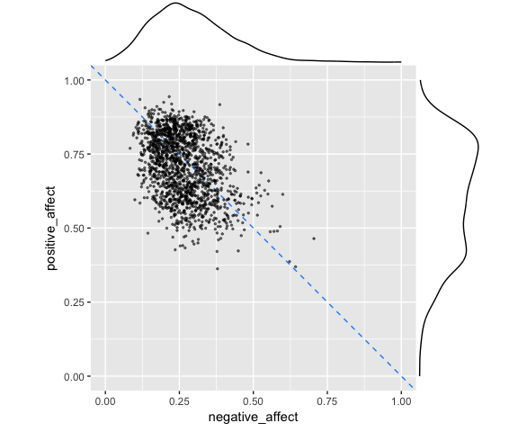<!-- -->

``` r
d %>%
  select_if(is.numeric) %>%
  select(-year, -starts_with("gini"), -starts_with("standard")) %>%
  cor(use = "pairwise") %>%
  as.data.frame() %>%
  rownames_to_column("var1") %>%
  gather(var2, cor, -var1) %>%
  mutate(var1 = fct_reorder(var1, cor, median),
         var2 = fct_reorder(var2, cor, median)) %>%
  ggplot(aes(x = var1, y = var2, fill = cor)) + 
  geom_raster() + 
  scale_fill_gradient2(midpoint = 0) + 
  coord_fixed() +
  theme(axis.text.x = element_text(angle = -90, hjust = 0, vjust = .5))
```

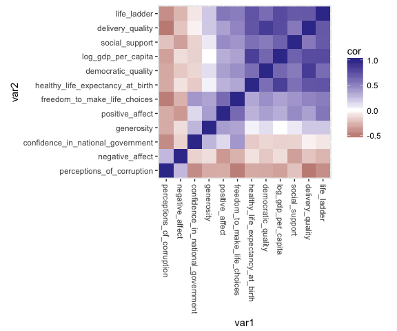<!-- -->

`dplyr` does joins\!

There’s another sheet in the dataset that has each country’s region.
Let’s attach those to this dataset.

``` r
readxl::excel_sheets("WHR2018Chapter2OnlineData.xls")
```

    ## [1] "Table2.1"          "Figure2.2"         "Figure2.3"        
    ## [4] "Figure2.4"         "SupportingFactors"

``` r
reg <- readxl::read_excel("WHR2018Chapter2OnlineData.xls", sheet = "SupportingFactors")
reg <- reg %>% select(country, region = `Region indicator`)
reg
```

    ## # A tibble: 156 x 2
    ##    country     region                            
    ##    <chr>       <chr>                             
    ##  1 Afghanistan South Asia                        
    ##  2 Albania     Central and Eastern Europe        
    ##  3 Algeria     Middle East and North Africa      
    ##  4 Angola      Sub-Saharan Africa                
    ##  5 Argentina   Latin America and Caribbean       
    ##  6 Armenia     Commonwealth of Independent States
    ##  7 Australia   North America and ANZ             
    ##  8 Austria     Western Europe                    
    ##  9 Azerbaijan  Commonwealth of Independent States
    ## 10 Bahrain     Middle East and North Africa      
    ## # ... with 146 more rows

``` r
count(reg, region, sort = TRUE)
```

    ## # A tibble: 10 x 2
    ##    region                                 n
    ##    <chr>                              <int>
    ##  1 Sub-Saharan Africa                    39
    ##  2 Latin America and Caribbean           22
    ##  3 Western Europe                        21
    ##  4 Middle East and North Africa          19
    ##  5 Central and Eastern Europe            17
    ##  6 Commonwealth of Independent States    12
    ##  7 Southeast Asia                         9
    ##  8 South Asia                             7
    ##  9 East Asia                              6
    ## 10 North America and ANZ                  4

``` r
filter(reg, str_detect(region, "ANZ"))
```

    ## # A tibble: 4 x 2
    ##   country       region               
    ##   <chr>         <chr>                
    ## 1 Australia     North America and ANZ
    ## 2 Canada        North America and ANZ
    ## 3 New Zealand   North America and ANZ
    ## 4 United States North America and ANZ

``` r
d <- left_join(d, reg) %>%
  select(country, region, everything())
```

    ## Joining, by = "country"

``` r
d
```

    ## # A tibble: 1,562 x 20
    ##    country    region     year life_ladder log_gdp_per_capi… social_support
    ##    <chr>      <chr>     <dbl>       <dbl>             <dbl>          <dbl>
    ##  1 Afghanist… South As… 2008.        3.72              7.17          0.451
    ##  2 Afghanist… South As… 2009.        4.40              7.33          0.552
    ##  3 Afghanist… South As… 2010.        4.76              7.39          0.539
    ##  4 Afghanist… South As… 2011.        3.83              7.42          0.521
    ##  5 Afghanist… South As… 2012.        3.78              7.52          0.521
    ##  6 Afghanist… South As… 2013.        3.57              7.50          0.484
    ##  7 Afghanist… South As… 2014.        3.13              7.48          0.526
    ##  8 Afghanist… South As… 2015.        3.98              7.47          0.529
    ##  9 Afghanist… South As… 2016.        4.22              7.46          0.559
    ## 10 Afghanist… South As… 2017.        2.66              7.46          0.491
    ## # ... with 1,552 more rows, and 14 more variables:
    ## #   healthy_life_expectancy_at_birth <dbl>,
    ## #   freedom_to_make_life_choices <dbl>, generosity <dbl>,
    ## #   perceptions_of_corruption <dbl>, positive_affect <dbl>,
    ## #   negative_affect <dbl>, confidence_in_national_government <dbl>,
    ## #   democratic_quality <dbl>, delivery_quality <dbl>,
    ## #   standard_deviation_of_ladder_by_country_year <dbl>,
    ## #   standard_deviation_mean_of_ladder_by_country_year <dbl>,
    ## #   gini_index_world_bank_estimate_ <dbl>,
    ## #   gini_index_world_bank_estimate_average_2000_15 <dbl>,
    ## #   gini_of_household_income_reported_in_gallup_by_wp5_year <dbl>

``` r
d %>%
  group_by(country, region) %>%
  summarize_at(vars(-year), mean, na.rm = TRUE) %>%
  ggplot(aes(x = log_gdp_per_capita, y = life_ladder)) + 
  geom_point() + 
  facet_wrap(~region, ncol = 3)
```

    ## Warning: Removed 3 rows containing missing values (geom_point).

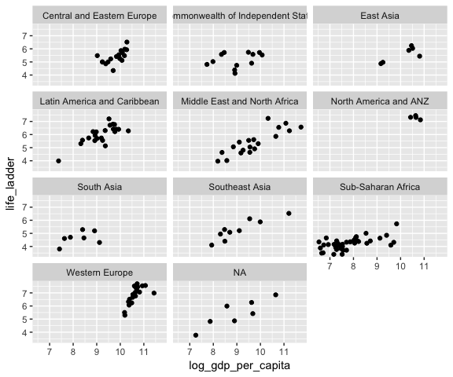<!-- -->

``` r
d %>%
  filter(is.na(region)) %>%
  distinct(country)
```

    ## # A tibble: 8 x 1
    ##   country          
    ##   <chr>            
    ## 1 Comoros          
    ## 2 Cuba             
    ## 3 Djibouti         
    ## 4 Guyana           
    ## 5 Oman             
    ## 6 Somaliland region
    ## 7 Suriname         
    ## 8 Swaziland

# `purrr`

`purrr` is awesome, and underappreciated. I think it’s more valuable for
programming than for EDA, but here are some of my favorite things.

## Improved `vapply`

``` r
map_lgl(d, is.numeric)
```

    ##                                                 country 
    ##                                                   FALSE 
    ##                                                  region 
    ##                                                   FALSE 
    ##                                                    year 
    ##                                                    TRUE 
    ##                                             life_ladder 
    ##                                                    TRUE 
    ##                                      log_gdp_per_capita 
    ##                                                    TRUE 
    ##                                          social_support 
    ##                                                    TRUE 
    ##                        healthy_life_expectancy_at_birth 
    ##                                                    TRUE 
    ##                            freedom_to_make_life_choices 
    ##                                                    TRUE 
    ##                                              generosity 
    ##                                                    TRUE 
    ##                               perceptions_of_corruption 
    ##                                                    TRUE 
    ##                                         positive_affect 
    ##                                                    TRUE 
    ##                                         negative_affect 
    ##                                                    TRUE 
    ##                       confidence_in_national_government 
    ##                                                    TRUE 
    ##                                      democratic_quality 
    ##                                                    TRUE 
    ##                                        delivery_quality 
    ##                                                    TRUE 
    ##            standard_deviation_of_ladder_by_country_year 
    ##                                                    TRUE 
    ##       standard_deviation_mean_of_ladder_by_country_year 
    ##                                                    TRUE 
    ##                         gini_index_world_bank_estimate_ 
    ##                                                    TRUE 
    ##          gini_index_world_bank_estimate_average_2000_15 
    ##                                                    TRUE 
    ## gini_of_household_income_reported_in_gallup_by_wp5_year 
    ##                                                    TRUE

``` r
map_dbl(d, ~ sum(is.na(.x)))
```

    ##                                                 country 
    ##                                                       0 
    ##                                                  region 
    ##                                                      17 
    ##                                                    year 
    ##                                                       0 
    ##                                             life_ladder 
    ##                                                       0 
    ##                                      log_gdp_per_capita 
    ##                                                      27 
    ##                                          social_support 
    ##                                                      13 
    ##                        healthy_life_expectancy_at_birth 
    ##                                                       9 
    ##                            freedom_to_make_life_choices 
    ##                                                      29 
    ##                                              generosity 
    ##                                                      80 
    ##                               perceptions_of_corruption 
    ##                                                      90 
    ##                                         positive_affect 
    ##                                                      18 
    ##                                         negative_affect 
    ##                                                      12 
    ##                       confidence_in_national_government 
    ##                                                     161 
    ##                                      democratic_quality 
    ##                                                     171 
    ##                                        delivery_quality 
    ##                                                     171 
    ##            standard_deviation_of_ladder_by_country_year 
    ##                                                       0 
    ##       standard_deviation_mean_of_ladder_by_country_year 
    ##                                                       0 
    ##                         gini_index_world_bank_estimate_ 
    ##                                                     979 
    ##          gini_index_world_bank_estimate_average_2000_15 
    ##                                                     176 
    ## gini_of_household_income_reported_in_gallup_by_wp5_year 
    ##                                                     357

## Improved `plyr::ldply`

``` r
map_df(1:5, ~ data_frame(int = .x,
                         sq = .x ^ 2,
                         letter = letters[.x]))
```

    ## # A tibble: 5 x 3
    ##     int    sq letter
    ##   <int> <dbl> <chr> 
    ## 1     1    1. a     
    ## 2     2    4. b     
    ## 3     3    9. c     
    ## 4     4   16. d     
    ## 5     5   25. e

## Improved `mapply`

``` r
map2_chr(c("James", "Jill", "Joe"), c(9, 12, 7), ~ paste(.x, "is", .y, "years old."))
```

    ## [1] "James is 9 years old." "Jill is 12 years old." "Joe is 7 years old."

## Improved `unlist`

``` r
nested_list <- 
  list(
    outer1 = list(
      inner1 = 1:3,
      inner2 = 4:6
    ),
    outer2 = list(
      inner1 = letters[1:3],
      inner2 = letters[4:6]
    )
  ) 
flatten(nested_list)
```

    ## $inner1
    ## [1] 1 2 3
    ## 
    ## $inner2
    ## [1] 4 5 6
    ## 
    ## $inner1
    ## [1] "a" "b" "c"
    ## 
    ## $inner2
    ## [1] "d" "e" "f"

## Transpose lists

``` r
transpose(nested_list)
```

    ## $inner1
    ## $inner1$outer1
    ## [1] 1 2 3
    ## 
    ## $inner1$outer2
    ## [1] "a" "b" "c"
    ## 
    ## 
    ## $inner2
    ## $inner2$outer1
    ## [1] 4 5 6
    ## 
    ## $inner2$outer2
    ## [1] "d" "e" "f"

## Improved `tryCatch`

``` r
safe_square <- safely(~ .x ^ 2)
safe_square(2)
```

    ## $result
    ## [1] 4
    ## 
    ## $error
    ## NULL

``` r
safe_square("A")
```

    ## $result
    ## NULL
    ## 
    ## $error
    ## <simpleError in .x^2: non-numeric argument to binary operator>

# More Explore

Life ladder is our main variable of interest, so let’s look at how it is
distributed and what might be driving it.

First let’s look for trend over time.

``` r
d %>%
   ggplot(aes(x = factor(year), y = life_ladder)) + 
   geom_boxplot()
```

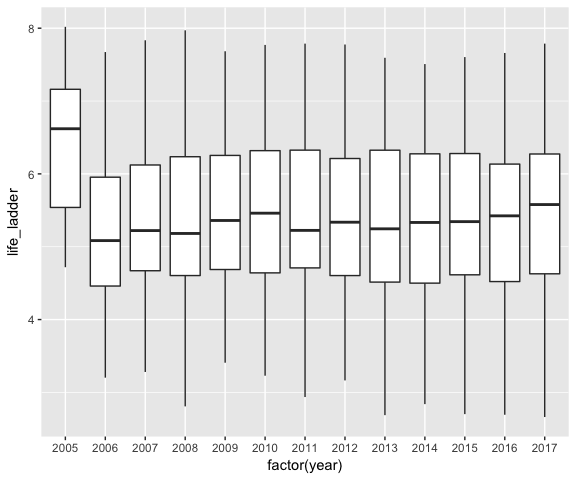<!-- -->

Hmm, 2005 looks anomalous. I bet there’s missing data there. Let’s see.

``` r
d %>%
  group_by(year) %>%
  mutate(count = n()) %>%
  ggplot(aes(x = paste0(year, "\nn=", count), y = life_ladder)) + 
  geom_boxplot()
```

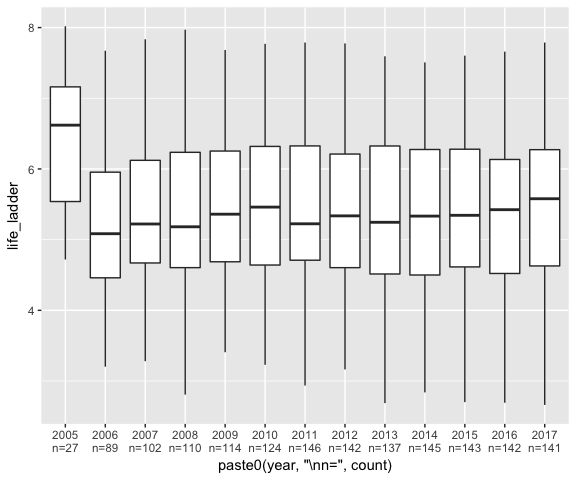<!-- -->

Okay, maybe a slight upward trend over time. How unequal are the
regions?

``` r
d %>%
  ggplot(aes(x = fct_reorder(region, life_ladder, median), y = life_ladder)) +
  geom_boxplot() +
  coord_flip()
```

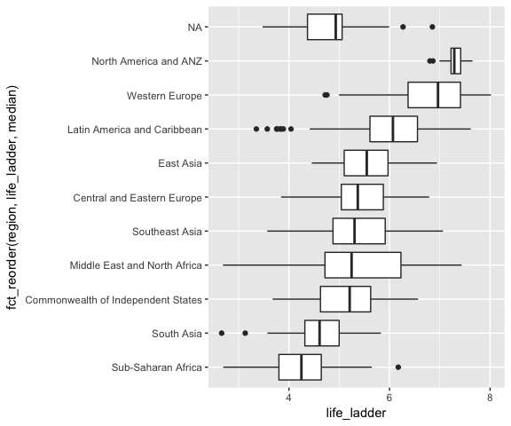<!-- -->

Is the trend over time different among regions?

``` r
d %>%
  filter(!is.na(region)) %>%
  ggplot(aes(x = year, y = life_ladder, group = country, color = region)) + 
  geom_smooth(se = FALSE, method = "lm", size = .25) + 
  facet_wrap(~ region, ncol = 3) + 
  guides(color = FALSE) +
  scale_x_continuous(labels = function(x) round(x, 0))
```

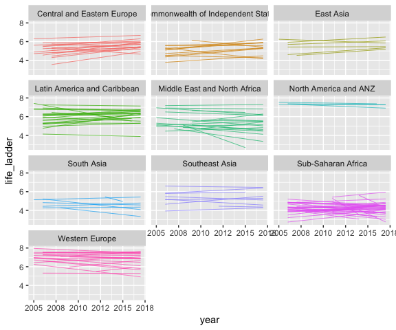<!-- -->

Hmm, hard to tell. Let’s fit a linear model of life ladder vs. year for
each country and then look at the slope coefficients across region.
Obviously this isn’t good statistical practice, but it might be a
reasonable way to explore trends, and more importantly, it allows
demonstration of some neat tidyverse functionality.

``` r
d %>%
  filter(!is.na(life_ladder), !is.na(region)) %>%
  group_by(country) %>%
  do(model = lm(life_ladder ~ year, .)) %>%
  mutate(beta_year = coef(model)["year"]) %>%
  left_join(select(d, country, region)) %>%  # Could've included region in group by, but isn't it neat how easy joins are!?
  ggplot(aes(x = fct_reorder(region, beta_year, median), y = beta_year)) + 
  geom_boxplot() + 
  coord_flip() 
```

    ## Joining, by = "country"

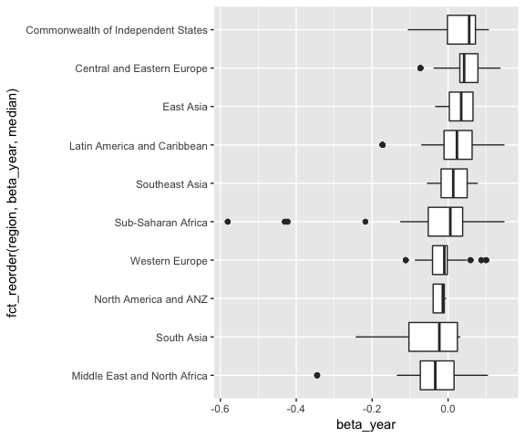<!-- -->

Interesting… it seems like the greatest positive trend is in regions
where there’s been substantial economic development over this period.
Let’s fit another set of models: change of GDP over time, and plot those
coefficients against the coefficients for life ladder.

``` r
d %>%
  filter(!is.na(life_ladder), !is.na(region), !is.na(log_gdp_per_capita)) %>%
  group_by(country, region) %>%
  do(ladder_model = lm(life_ladder ~ year, .),
     gdp_model = lm(log_gdp_per_capita ~ year, .)) %>%
  mutate(beta_ladder = coef(ladder_model)["year"],
         beta_gdp = coef(gdp_model)["year"]) %>%
  ggplot(aes(x = beta_gdp, y = beta_ladder, label = country)) + 
  geom_smooth(method = "lm", color = "black") +
  geom_text(aes(color = region), size = 4, check_overlap = TRUE) + 
  guides(color = FALSE) 
```

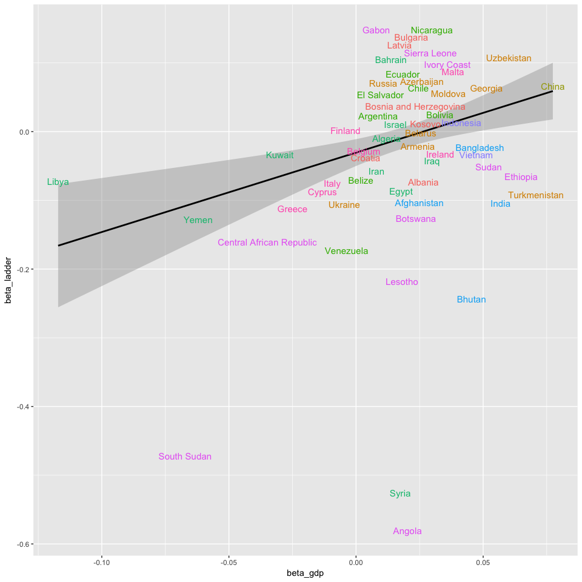<!-- -->

Look at that upward slope: Countries that have seen more growth in their
per-capita GDP over this period have seen more growth in their
assessment of well-being.

# Does satisfaction saturate with income?

There’s a well-trod finding from behavioral economics that increasing
income increases happiness up to a point, but then saturates. Let’s see
if there’s evidence for that in this dataset. We’ll look at each
country’s median GDP and satisfaction (life ladder) here and ignore
changes over time.

``` r
country_medians <- 
  d %>%
  group_by(country) %>%
  summarize(gdp = median(exp(log_gdp_per_capita)),
            ladder = median(life_ladder))
linear_gdp_plot <- 
  country_medians %>%
  ggplot(aes(x = gdp, y = ladder)) + 
  geom_point() 
log_gdp_plot <- 
  country_medians %>%
  ggplot(aes(x = gdp, y = ladder)) + 
  geom_smooth(method = "lm") +
  geom_point() +
  scale_x_log10() + 
  annotation_logticks(sides = "b")
cowplot::plot_grid(linear_gdp_plot, log_gdp_plot)
```

    ## Warning: Removed 11 rows containing missing values (geom_point).

    ## Warning: Removed 11 rows containing non-finite values (stat_smooth).

    ## Warning: Removed 11 rows containing missing values (geom_point).

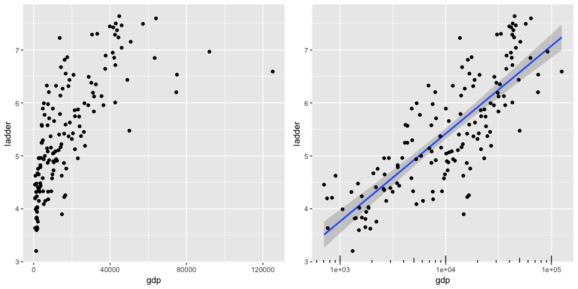<!-- -->

You could certainly interpret the left plot, of satisfaction as a
function of linear GPD as saturating around $ 40k / year and being flat
after that. However, it also looks like a logarithmic relationship that
would indicate decreasing marginal utility of income, but not
saturating. The plot on the right shows this relationship with a linear
fit line. We can use the `augment` function from the `broom` package to
extract the residuals from this model. If those residuals were trending
negative as income increased, that would provide evidence of a
saturating relationship.

``` r
m <- lm(ladder ~ log10(gdp), country_medians)
broom::augment(m) %>%
  ggplot(aes(x = log10.gdp., y = .resid)) + 
  geom_smooth(method = "lm") +
  geom_point()
```

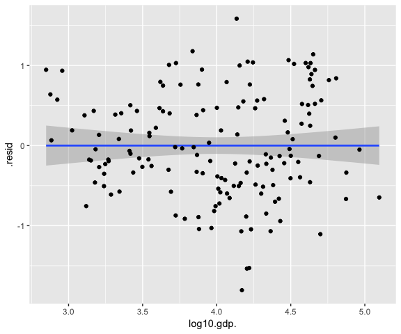<!-- -->

In reality, the residuals look stationary and well distributed,
supporting the idea of satisfaction increasing as a logarithmic, but not
fully saturating, effect of income.

# Data Appendix

Ladder:

Please imagine a ladder with steps numbered from zero at the bottom to
ten at the top. Suppose we say that the top of the ladder represents the
best possible life for you and the bottom of the ladder represents the
worst possible life for you. If the top step is 10 and the bottom step
is 0, on which step of the ladder do you feel you personally stand at
the present time?

Taken from 2018 report, p. 20.

1.  GDP per capita is in terms of Purchasing Power Parity (PPP) adjusted
    to constant 2011 international dollars, taken from the World
    Development Indicators (WDI) released by the World Bank in September
    2017. See Appendix 1 for more details. GDP data for 2017 are not yet
    available, so we extend the GDP time series from 2016 to 2017 using
    country-specific forecasts of real GDP growth from the OECD Economic
    Outlook No. 102 (Edition November 2017) and the World Bank’s Global
    Economic Prospects (Last Updated: 06/04/2017), after adjustment for
    population growth. The equation uses the natural log of GDP per
    capita, as this form fits the data significantly better than GDP per
    capita.

2.  The time series of healthy life expectancy at birth are constructed
    based on data from the World Health Organization (WHO) and WDI. WHO
    publishes the data on healthy life expectancy for the year 2012. The
    time series of life expectancies, with no adjustment for health, are
    available in WDI. We adopt the following strategy to construct the
    time series of healthy life expectancy at birth: first we generate
    the ratios of healthy life expectancy to life expectancy in 2012 for
    countries with both data. We then apply the country-specific ratios
    to other years to generate the healthy life expectancy data. See
    Appendix 1 for more details.

3.  Social support is the national average of the binary responses
    (either 0 or 1) to the Gallup World Poll (GWP) question “If you were
    in trouble, do you have relatives or friends you can count on to
    help you whenever you need them, or not?”

4.  Freedom to make life choices is the national average of binary
    responses to the GWP question “Are you satisfied or dissatisfied
    with your freedom to choose what you do with your life?”

5.  Generosity is the residual of regressing the national average of GWP
    responses to the question “Have you donated money to a charity in
    the past month?” on GDP per capita.

6.  Perceptions of corruption are the average of binary answers to two
    GWP questions: “Is corruption widespread throughout the government
    or not?” and “Is corruption widespread within businesses or not?”
    Where data for government corruption are missing, the perception of
    business corruption is used as the overall corruption-perception
    measure.

7.  Positive affect is defined as the average of previous-day affect
    measures for happiness, laughter, and enjoyment for GWP waves 3-7
    (years 2008 to 2012, and some in 2013). It is defined as the average
    of laughter and enjoyment for other waves where the happiness
    question was not asked.

8.  Negative affect is defined as the average of previous-day affect
    measures for worry, sadness, and anger for all waves. See
    Statistical Appendix 1 for more details.
